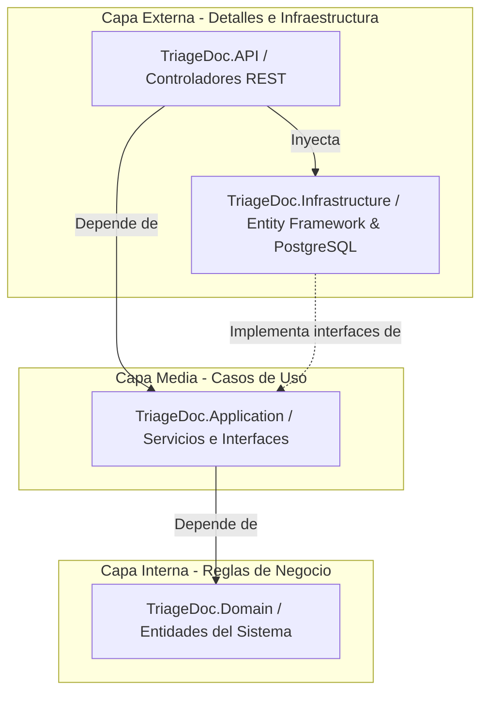

# 🩺 TriageDoc - Sistema Experto de Triage y Orientación Médica Preliminar

> **Materia:** IS-912 Sistemas Expertos (Programación Web)  
> **Arquitectura:** Monorepo con Clean Architecture (API-First), Docker y Principios SOLID  
> **Stack:** .NET (C#) Web API, PostgreSQL 16, Entity Framework Core, React (Frontend planeado)

---

## 📌 1. Descripción del Proyecto

**TriageDoc** es un sistema inteligente de clasificación de urgencias médicas (Triage) y orientación preliminar para pacientes. Basado en el estándar de clasificación de Manchester y reglas de inferencia clínica, el sistema analiza síntomas críticos, signos de alarma y antecedentes para recomendar de forma rápida el nivel de prioridad de atención (desde código azul/verde para casos leves hasta código naranja/rojo para emergencias vitales).

---

## 🏗️ 2. Arquitectura de la Solución (Clean Architecture)

El backend sigue estrictamente la **Regla de Dependencia** de Clean Architecture:



### Estructura del Monorepo:
* **`infra/`**: Contiene la orquestación de Docker Compose para PostgreSQL 16 y variables de entorno aisladas (12-Factor App).
* **`backend/`**:
  * `TriageDoc.Domain`: Entidades puras (`Sintoma`, `NivelPrioridad`, `EvaluacionTriage`).
  * `TriageDoc.Application`: Contratos e interfaces (`ITriageService`) y lógica del motor de inferencia básico (`TriageService`).
  * `TriageDoc.Infrastructure`: Contexto de Entity Framework Core (`TriageDocDbContext`) y mapeo a PostgreSQL.
  * `TriageDoc.API`: Puntos de entrada HTTP, carga de variables con `DotNetEnv` e inyección de dependencias.
* **`frontend/`**: Cliente web (React) para captura interactiva de síntomas y visualización de resultados.

---

## 🧩 3. Principios SOLID Aplicados

* **SRP (Single Responsibility):** Cada servicio se enfoca en un único objetivo (ej. `TriageService` procesa reglas clínicas; los controladores solo gestionan HTTP).
* **OCP (Open/Closed):** El motor de reglas está diseñado mediante interfaces para permitir nuevos algoritmos de inferencia sin alterar el flujo principal.
* **DIP (Dependency Inversion):** La capa de presentación (`API`) y los casos de uso (`Application`) dependen de abstracciones (`ITriageService`), no de implementaciones concretas.

---

## 📋 4. Backlog Inicial de Historias de Usuario

* **HU-01:** Como personal de triage, quiero consultar el catálogo de síntomas para clasificar al paciente.
* **HU-02:** Como usuario, quiero registrar mis síntomas principales y edad para recibir una evaluación preliminar.
* **HU-03:** Como sistema, debo identificar síntomas de bandera roja (dolor torácico, dificultad respiratoria severa) para asignar prioridad de emergencia inmediata.
* **HU-04:** Como administrador, quiero persistir las evaluaciones en PostgreSQL para auditoría clínica.
* **HU-05:** Como desarrollador, quiero aislar la infraestructura en Docker para replicar el entorno sin configurar bases de datos locales.
* **HU-06:** Como cliente API, quiero recibir respuestas estructuradas en formato JSON bajo arquitectura REST.
* **HU-07:** Como personal médico, quiero ver una justificación textual de la regla aplicada en la decisión del triage.

---

## 🚀 5. Puesta en Marcha Rápida

### 1. Iniciar Base de Datos con Docker
```bash
cd infra
docker-compose up -d
```

### 2. Configurar Variables de Entorno (.NET)
Copiar `.env.example` como `.env` dentro de `backend/TriageDoc.API/`:
```bash
cd ../backend/TriageDoc.API
cp .env.example .env
```

### 3. Ejecutar la API
```bash
dotnet restore
dotnet run --project backend/TriageDoc.API
```
Acceder a Swagger en: `https://localhost:7xxx/swagger` o `http://localhost:5xxx/swagger`.
